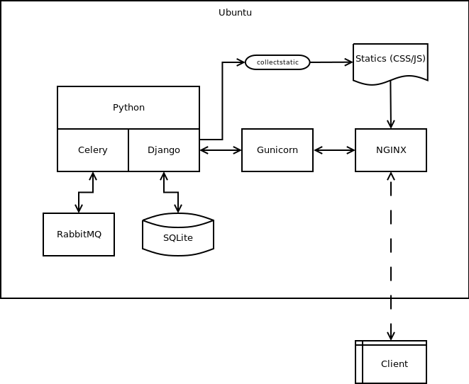

# API and Database Models

This airport application for incoming and outcoming flights from/to Schipol. The flights data is taken everyday at midnight from Schipol airport API. The API data provided from the Schipol API has rich variation keys, but their values in incomplete. Sometimes there are keys that just blank or null. Furthermore, there are little to no information on what each keys describes. Despite the two sole main issues, I chose to use this API because it is free and provides the most number of pulls out of other options there are available.

The main models are the `ArrivalDepartureFlight` model, which then inherited further to `ArrivalFlight` and `DepartureFlight` models. Initially they have unique fields like destined/origin airport and scheduled time for arrival and departure. However, I realize that the API only provides data from the Schipol airport side. Which means one other airport is always Schipol and the API does not provide time for flight's operation with the other airport. So in then end both `ArrivalFlight` and `DepartureFlight` come from `ArrivalDepartureFlight` without any unique field, just each stored in different tables.

Flight code, carrier's code, an airport field, and time field can be taken directly from the API. I only need to make a function to determine the day for each flights. There is many-to-many field for flight to be attached by air traffic controller (ATC). There is also many-to-many field for lane, for the flight later operates. The status field is a null-boolean field, with `null` when the flight is being in operation, `true` if the flight operation completed with an ATC and lane attached to the flight, and return `false` if, at most, one of the two elements is missing. During the development, I planned to have `real_local_time` and `past_atcs` as well. But I scrapped these to further simplify the development progress.

Both `ArrivalFlight` and `DepartureFlight` is filled initially from the Schipol API pull. However, ATC and lane are inputted manually by the user (airport manager).

The `Lane` models is just as a list of available runways in Schipol airport. This information is taken from Sciphol Wikipedia page, [here](https://en.wikipedia.org/wiki/Amsterdam_Airport_Schiphol).

The other model is the `AirTrafficController`, often referred as "ATC" in some comments inside the codes. It only has three characters fields: code, first name, and last name. There is nothing fancy in this model.

The `AirTrafficController` is supplied by logged-in airport manager via "ATC Registration Form" in the client user interface.

The last model I created is called `CeleryWorker` and is used to queue task in Celery task queue. This is necessary to prevent database locked because this project currently using SQLite as database, where multiple connection should not happen.

# Details of the Requirements.

An ATC and lane need to be attached to a arrival or departure flight before their scheduled operation time happen. Otherwise the flight status will be `false`. Additionally, the client user interface will tell the airport manager if a flight lacks of ATC or lane (or both).

At first there was a form to input the flight data manually. Now, Schipol API automatically take care of that. The Schipol API, I think, is rather young and under-developed. When I asked the admin, on why the API only return 20 objects at max per day they answered theoretically. However, they could not provide technical details (with programming language) on how to pull more than 20 objects. In the end, I made a custom Python script to automatically pull maximum data the API provide (nearly ~400 flights per day for both arrival and departure flights, cargo and non-cargo flights) and sent back the script to them.

The ATC is not assigned automatically by the system. The airport managers need to manually do that. However, at simplest it can be done with system detecting which ATCs has least workload (lesser amount of managed flight on average) and assign that ATC to an incoming operation. Even further, it system could detect if tha airport need more ATCs and if a certain flight needs more than one ATCs. Initially, I wanted to remove ATCs from finished operation, but that will take more time to develop.

The data provided from the API and data from the airport manager are shown in a simple table with pagination. Sort function does not exists. This is because I could not understand how the table library works for AJAX request. Hence, I made my own flight tables with Bootstrap. However, there is no summarization on overall operation in whole. So to sum up, the information is displayed only within this SPA with tables (for ATCs and flights) and a management panel that displays more information about selected flight.

At this point, if data is not exist (deleted via admin control panel) it will return 404 error. There are only three notifications exists if the airport manager do an error within the client user interface: when user inputted wrong username and password combination, when user tried to register airport manager username that is already in database, and when user tried to register an ATC which has its code already in database.

# Application Structure and Schema

[./structure.dia](structure.dia)